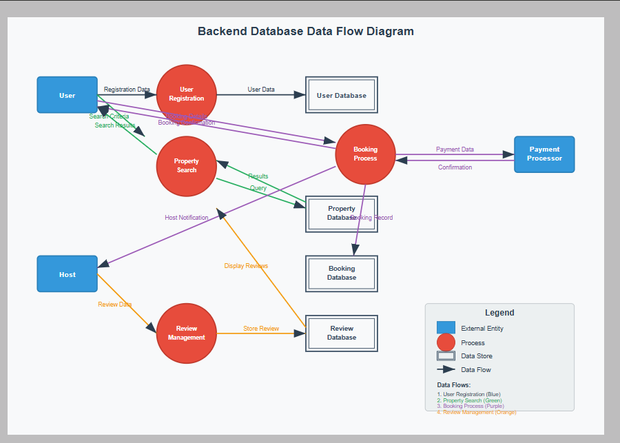

# Airbnb Clone - Data Flow Diagram

Key Data Flows:
1. User registration data → Database
2. Property search criteria → Search service → Results to user
3. Booking details → Payment processor → Confirmation to user/host
4. Review data → Database → Display on property page